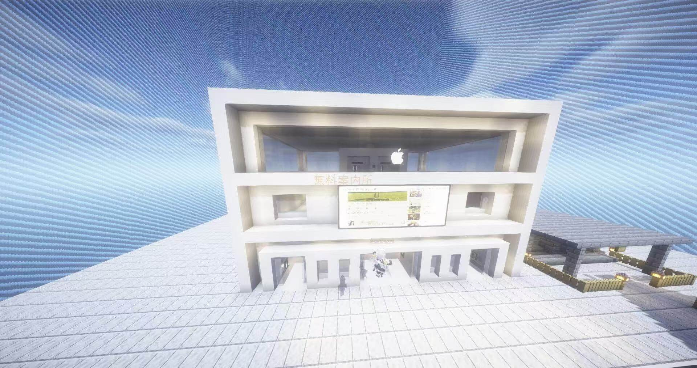

# Zycraft Server Updater

## 中文版

**Zycraft客户端更新器**  
此更新器仅用于自动更新游戏文件，包括但不限于：材质包、模组、光影等。请注意，游戏本身由 Mojang AB 开发并未进行任何再次分发篡改。所有内置模组、材质包、光影等由开发者所有，版权归开发者所有。

### 重要提示：
- 要想进入 **Zycraft** 服务器，您需要先安装并更新 **Zycraft 游戏文件更新器**。
- 更新内容包括材质包、模组、光影等，所有更新文件将被自动下载并更新至您游戏的主要文件夹中。
- **Zycraft 游戏文件更新器** 仅提供自动更新功能，并不包含完整的游戏本体文件，更新后的文件将直接放置在游戏目录中。

### 免责声明：
- 本更新器当前不是最终版，未来仍可能会继续更新和完善。
- 更新器目前可能会存在一些 bug，我们正在努力修复并提升效率。感谢您的理解与耐心。
- 请注意，由于更新器仍处于开发阶段，可能会影响更新效率，请理解和谅解。

### 官方资源：
- 官网：[mc.lzyablo.top](http://mc.lzyablo.top)
- 个人博客：[blo.lzyablo.top/home](http://blo.lzyablo.top/home)

---

## English Version

**Zycraft Client Updater**  
This updater is used solely for automatically updating game files, including but not limited to: resource packs, mods, shaders, etc. Please note that the game itself is developed by Mojang AB and has not been redistributed or altered. All embedded mods, resource packs, shaders, etc. are owned by the developers, and the copyright belongs to the developers.

### Important Notes:
- To enter the **Zycraft** server, you need to first install and update the **Zycraft Game File Updater**.
- The update includes resource packs, mods, shaders, etc. All updated files will be automatically downloaded and placed into your main game folder.
- The **Zycraft Game File Updater** only provides automatic update functionality and does not contain the full game files. The updated files will be directly placed in your game directory.

### Disclaimer:
- This updater is not the final version; it may continue to be updated and improved in the future.
- The updater may currently have some bugs, and we are working to fix them and improve efficiency. Thank you for your understanding and patience.
- Please note that since the updater is still in development, it may affect the update efficiency. We ask for your understanding and forgiveness.

### Official Resources:
- Official Website: [mc.lzyablo.top](http://mc.lzyablo.top)
- Personal Blog: [blo.lzyablo.top/home](http://blo.lzyablo.top/home)

